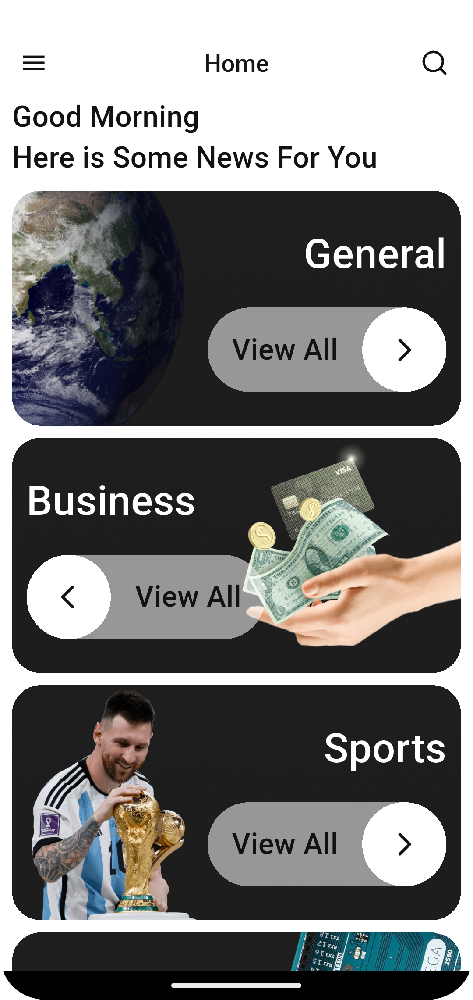
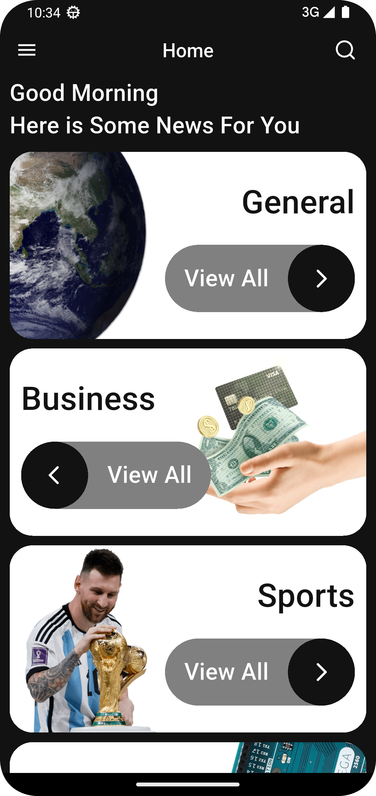
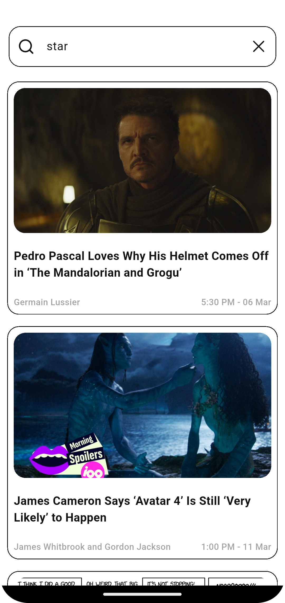
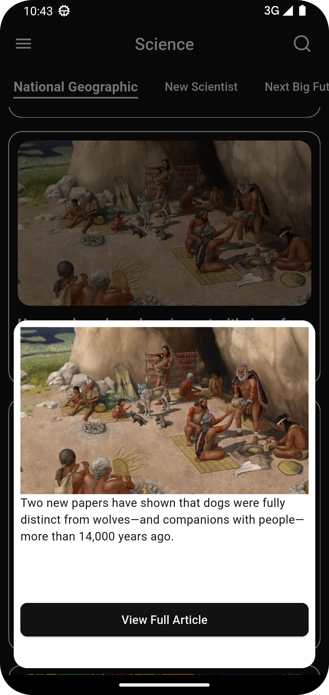
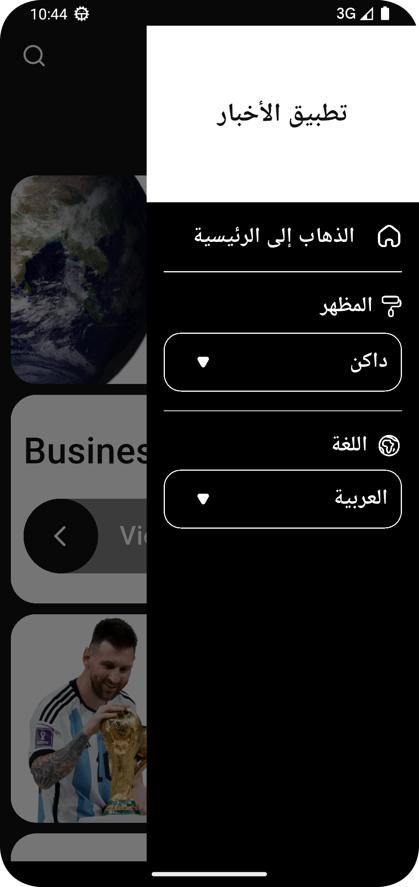

# 📰 News App
A modern Flutter news application that delivers real-time articles with a clean UI, theme support, and multi-language experience.

## ✨ Overview
This project demonstrates building a scalable Flutter application using feature-based architecture and clean state management.

## 🚀 Features
- 🧠 State Management using Cubit (Bloc)
- 🌙 Light & Dark Theme support
- 🌍 Multi-language support (Localization) 
- 🔍 Search functionality
- 🌐 API integration for real-time news
- 💾 Local storage using SharedPreferences
- 📄 Pagination for loading more articles

## 🌍 Localization
The app supports multiple languages using Flutter localization (ARB files).

- Supports English & Arabic
- Easy to add new languages
- Dynamic language switching
- Organized translation files

## 📱 Screenshots
|🌞 Light Mode|🌙 Dark Mode|🔍 Search|
|--------------|------------|----------|
||||

|📰 Articles View|📰 Article Details|🌍 Arabic Language|
|-----------------|------------------|------------------|
|||

 

## 🛠️ Tech Stack
- Flutter
- Dart
- Bloc / Cubit
- REST API
- SharedPreferences
- Localization (intl, flutter_localizations)

## 📂 Project Structure
The project follows a feature-based structure with separation of concerns.

## ▶️ Getting Started
1. Clone the repo
2. Run `flutter pub get`
3. Run the app

## 💡 What I Learned
- Managing app state using Cubit
- Handling API integration
- Building scalable Flutter apps
- Implementing theme persistence using SharedPreferences
- Working with localization (multi-language support)
- Handling pagination for better performance
- 
## 🤝 Feedback
I’d love to hear your feedback!

## 📬 Contact
Linkedin : (www.linkedin.com/in/dalia-galal-4a4985250)
